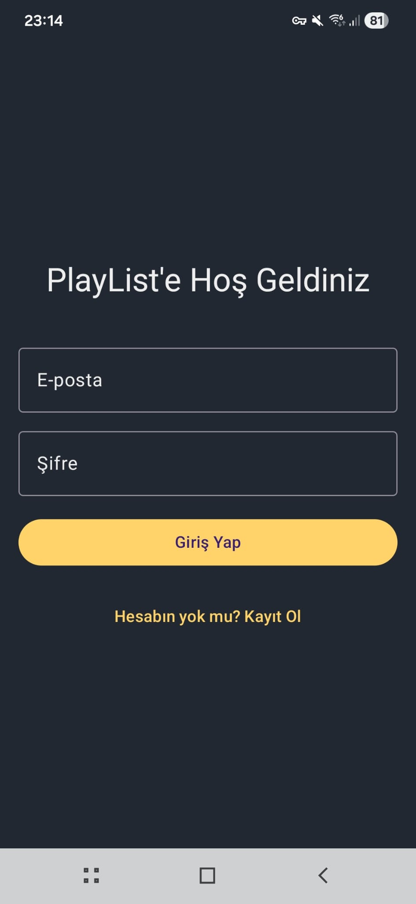
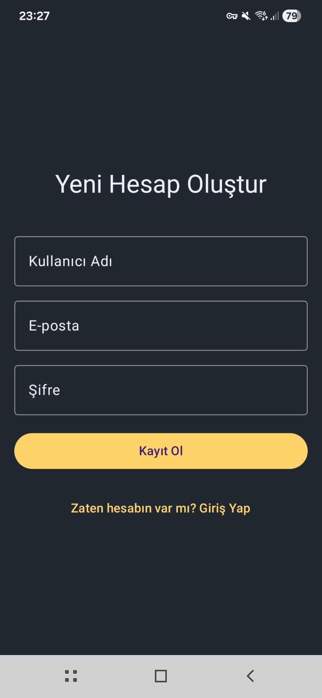
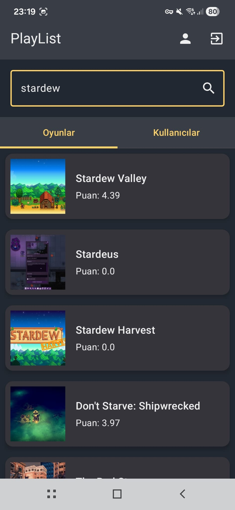
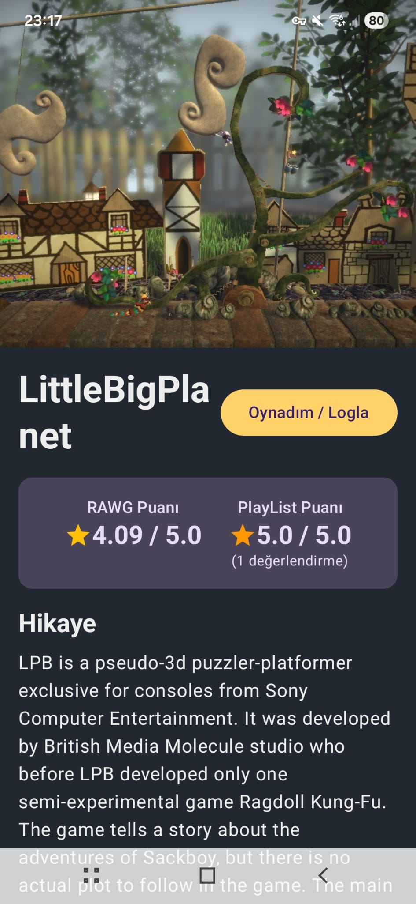
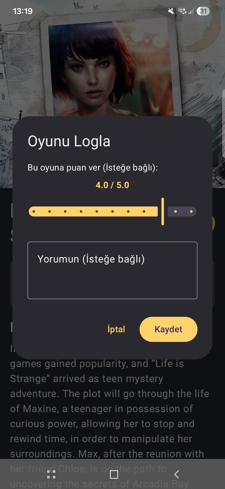
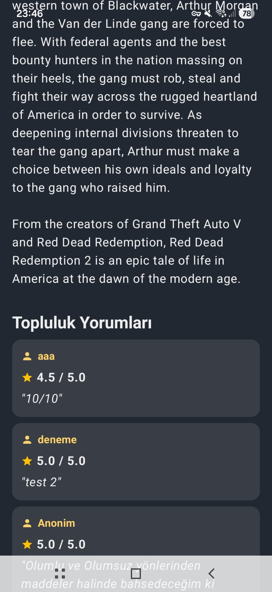
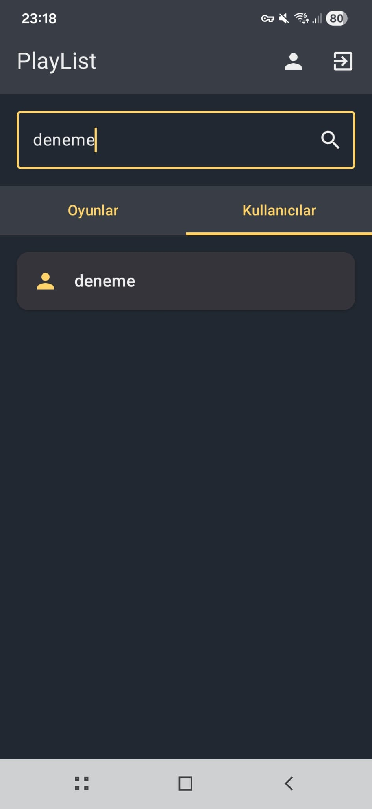
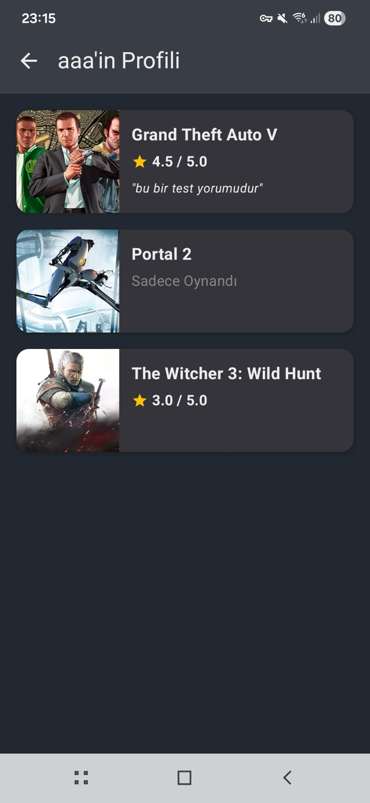
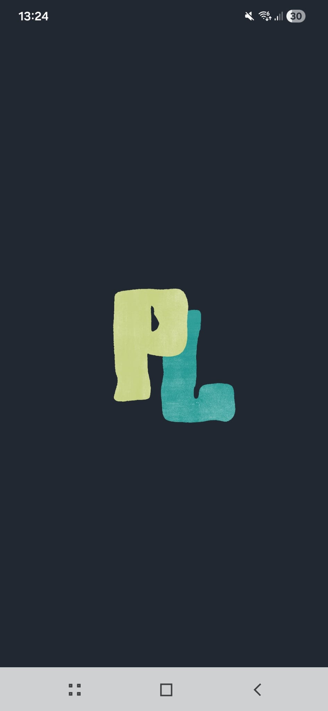
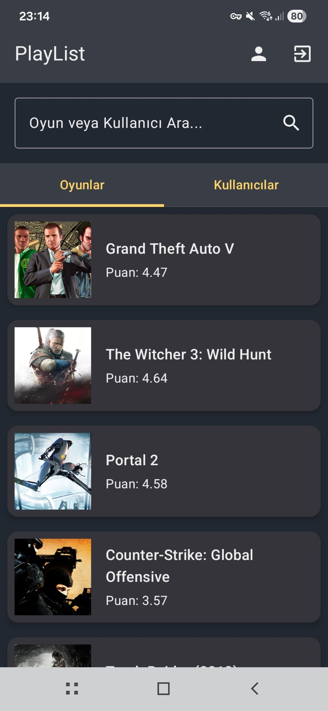

# PlayList

## Overview
PlayList is an Android application designed for gamers to discover, log, and rate their favorite video games. Acting as a social network for gaming enthusiasts, the app integrates a massive game database with Firebase services to provide a seamless user experience. It encourages a community-driven environment where users can share reviews, explore other players' profiles, and build their personalized gaming libraries.

<div align="center">
  
  
</div>
<br>

## Features
* **Universal Search:** A unified search experience with dedicated tabs to find over 500,000 video games (via RAWG API) or discover other users within the platform.

<div align="center">
  
  
</div>

<br>

* **Game Logging & Rating:** Users can easily track their gaming journey by logging played games, rating them out of 5.0, and writing personal reviews.

<div align="center">
  
  
</div>

<br>

* **Social Network Dynamics:** Features dynamic routing to visit other users' profiles, view their specific game logs, and read community reviews directly on game detail pages.

<div align="center">
  
  
</div>

<br>

* **Modern UI/UX:** A carefully crafted gamer dark theme optimized for readability, coupled with an interactive Splash Screen featuring an overshoot animation and an Adaptive App Icon.

<div align="center">
  
  
</div>

<br>

## Architecture
The app strictly follows **Clean Architecture** principles, divided into `Presentation`, `Domain`, and `Data` layers, ensuring high modularity and scalability. It utilizes the **MVVM (Model-View-ViewModel)** pattern to separate business logic from UI components. Dependency Injection is handled via a centralized `ViewModelFactory` to streamline the creation and lifecycle of ViewModels without relying on heavy third-party DI frameworks.

## Key Components
* **Dynamic Navigation (Compose Navigation):** Handles seamless transitions between screens, including complex routing with optional arguments for dynamic user profiles.
* **Repository Pattern:** Abstracts data sources. `GameRepository` manages API calls, while `AuthRepository` and `LogRepository` handle Firebase interactions.
* **State Management:** Utilizes Kotlin `State` and `StateFlow` to ensure the UI strictly observes and reacts to data changes in real-time.
* **Firebase Services:** Manages robust user authentication and NoSQL data structuring for quick retrieval of user profiles and community reviews.

## Technologies Used
* **UI Toolkit:** Jetpack Compose, Material Design 3
* **Programming Language:** Kotlin
* **Architecture:** MVVM, Clean Architecture
* **Asynchronous Programming:** Coroutines & Flow
* **Networking & API:** Retrofit2, Gson, RAWG Video Games Database API
* **Backend & Database:** Firebase Authentication, Firebase Firestore
* **Image Loading:** Coil (Asynchronous image processing)

## Installation

### Prerequisites
* Android Studio Iguana (or later)
* Minimum SDK 24 (Android 7.0)
* A Firebase project configured with Firestore and Authentication (Email/Password) enabled.
* A free API key from [RAWG.io](https://rawg.io/apidocs).

### Steps
1. Clone the repository:
   ```bash
   git clone https://github.com/zk-batmaz/PlayList.git
2. Open the project in Android Studio.

3. Configure API Key: Add your free RAWG API Key directly into the `GameRepositoryImpl.kt` file where the network requests are executed.

4. Configure Firebase: Add your google-services.json file to the app/ directory.

5. Build and Run: Press Cmd + R (Mac) or Shift + F10 (Windows) to run the app on an emulator or physical device.

### Usage

Launch the app and sign up or log in.

Use the search bar to find a specific game or switch tabs to search for other players.

Tap on a game to view details, RAWG statistics, and community reviews.

Click "Oynadım / Logla" to add the game to your library with an optional rating and review.

Tap on any user's name in the community reviews to dynamically route to their personal profile and explore their gaming history.
